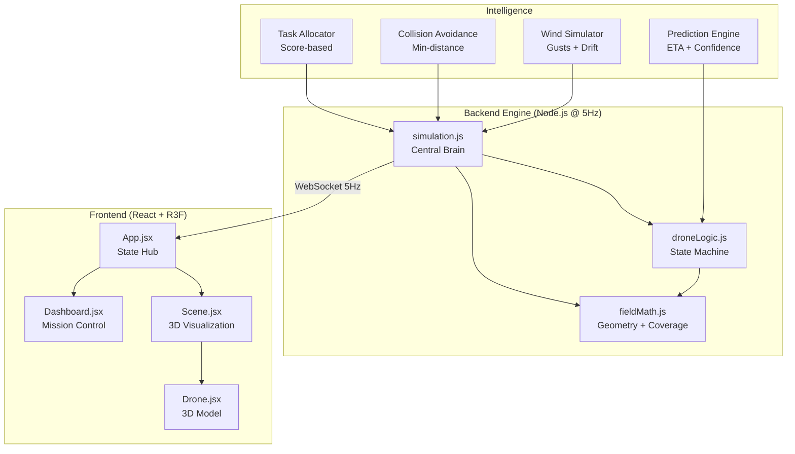
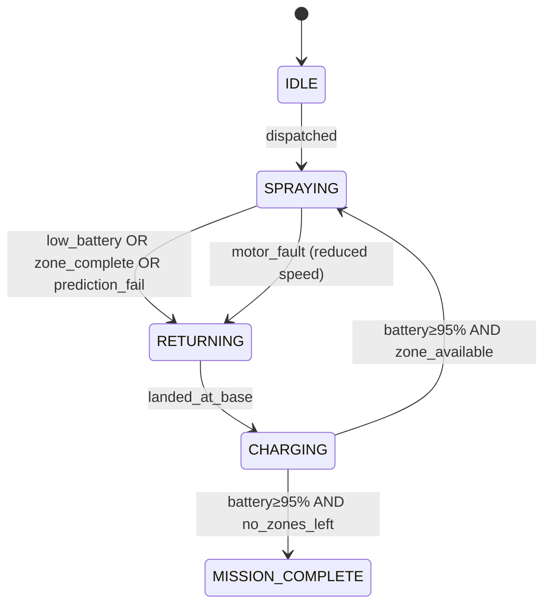

# AgriTwin Digital Twin — System Architecture

## Live Screenshots

````carousel

<!-- slide -->

<!-- slide -->

````

---

## Architecture Overview



---

## 1. Digital Twin Engine — Central Brain

**File:** [simulation.js](file:///Users/priyanshu/Downloads/alalal/backend/engine/simulation.js)

The simulation loop runs at **200ms intervals (5Hz)** and executes this pipeline every tick:

```
updateWorldState() {
  1. _updateWind()          → shift wind vector
  2. tickDrone(each)        → move, drain, spray
  3. _handleHandoff()       → dispatch next drone
  4. _handleRedeployment()  → charged drones → new zones
  5. _checkCollisions()     → proximity avoidance
  6. _buildPayload()        → serialize + emit via WebSocket
}
```

---

## 2. Simulated Hardware Layer

**File:** [droneLogic.js](file:///Users/priyanshu/Downloads/alalal/backend/engine/droneLogic.js)

Each drone emits **realistic telemetry per tick**:

| Signal | Source | Realism |
|--------|--------|---------|
| Position (x, y, z) | Waypoint interpolation | + Gaussian GPS noise (σ=0.03) |
| Speed | `BASE_SPEED / TICK_S` | + Speed noise (σ=0.008) + wind effect |
| Battery | Multi-factor drain model | Movement + spray + hover drains |
| Spray rate | `moved / TREE_SPACING` | Trees per tick |
| Status | 5-state machine | IDLE → SPRAYING → RETURNING → CHARGING → redeploy |

### Battery Drain Model
```
Per tick:
  MOVE_DRAIN  × distance_moved    (0.008%/unit)
  SPRAY_DRAIN × TICK_S            (0.04%/sec while spraying)
  HOVER_DRAIN × TICK_S            (0.003%/sec while airborne)
  
Charge rate: +0.25%/tick when at base
```

### Noise & Randomness
- **GPS jitter**: `gaussRandom() × 0.03` on X and Z each tick
- **Speed variation**: `gaussRandom() × 0.008` per tick
- **Wind drift**: `wind.dx × wind.speed × 0.002` lateral push
- **Motor fault**: 0.008% chance/tick → 5-tick reduced thrust → auto-recovery

---

## 3. State Machine



Key states:
- **CHARGING** (new): Drone recharges at 0.25%/tick, can be **redeployed** to uncompleted zones
- **Prediction-driven RTB**: Drone returns if prediction says it can't finish the zone

---

## 4. Intelligent Task Allocation

```
score(drone, zone) =
  battery_weight(0.4) × (drone.battery / 100)
  + distance_weight(0.3) × (1 - dist(drone, zone.center) / maxDist)
  + missions_weight(0.3) × (1 - drone.missionsFlown / 6)
```

Rules:
- Only considers `IDLE` or fully `CHARGED` drones
- Drones that have flown fewer missions get priority (load balancing)
- Nearest drone with highest battery wins
- **Dynamic reassignment**: When a drone returns (low battery), the allocator immediately finds the best replacement

---

## 5. Battery-Aware Decision Making

The prediction engine runs **every tick** for active drones:

```javascript
drainPerTick = (BASE_SPEED × MOVE_DRAIN) + (SPRAY_DRAIN × TICK_S) + (HOVER_DRAIN × TICK_S)
ticksToFinish = (remainingWaypoints × TREE_SPACING) / (BASE_SPEED / TICK_S) / TICK_S
batteryAtFinish = currentBattery - (drainPerTick × ticksToFinish)
returnCost = returnDistance × MOVE_DRAIN + returnTicks × HOVER_DRAIN

canFinish = batteryAtFinish > (LOW_BATTERY_THRESHOLD + returnCost)
```

Grace period: Prediction check only activates after 50+ waypoints to avoid false positives at mission start.

---

## 6. Event System

**Typed events** with structured format:

```json
{
  "id": 42,
  "message": "RTB:drone_1:insufficient_battery_for_zone:45.3%",
  "timestamp": 1777179000000,
  "type": "warning"
}
```

| Type | Events |
|------|--------|
| `info` | DISPATCHED, REDEPLOYED, LANDED, FAULT_CLEARED |
| `success` | ZONE_COMPLETE, CHARGE_READY, MISSION_COMPLETE, ALL_ZONES_COMPLETE |
| `warning` | RTB (low battery), PROXIMITY_ALERT |
| `error` | MOTOR_FAULT |

Persistent buffer of last 50 events included in `getState()` for newly connecting clients.

---

## 7. Prediction Layer

Each spraying drone exposes:

| Metric | Description |
|--------|-------------|
| `canFinishZone` | Boolean — enough battery to complete + return? |
| `etaSeconds` | Estimated time to finish current zone |
| `batteryAtFinish` | Predicted battery % when zone is done |
| `confidence` | 0.3–0.99 score (increases with progress, decreases with wind) |

---

## 8. Multi-Drone Coordination

### Collision Avoidance
- **Min safe distance**: 8 world units between airborne drones
- Lower-battery drone is nudged away (1 unit)
- Rate-limited alerts: max 1 per pair per 5 seconds

### Zone Exclusivity
- Each zone can only be assigned to **one drone at a time**
- Zone is freed when drone returns, allowing reassignment

---

## 9. Wind Simulation

```
Wind vector changes every 10-40 seconds
Direction: slowly drifting (Gaussian noise on angle)
Speed: 0-5 scale, occasional gusts (10% chance of strong shift)
Effect: headwind/tailwind affects drone speed, lateral drift on position
```

---

## 10. Data Models

### Drone
```javascript
{
  id, position: {x, y, z}, battery, status,
  assignedZone, speed, efficiency, distanceTraveled,
  sprayingArea, motorFault, missionsFlown,
  prediction: { canFinishZone, etaSeconds, batteryAtFinish, confidence },
  trail: [{x, z}],
}
```

### Zone
```javascript
{
  id, status, completionPct, assignedDrone,
  bounds: { xMin, xMax, zMin, zMax },
  area, _coverageGrid: Uint8Array,
}
```

### Event
```javascript
{
  id, message, timestamp, type
}
```

---

## Files Modified

| File | Role | Key Changes |
|------|------|-------------|
| [fieldMath.js](file:///Users/priyanshu/Downloads/alalal/backend/engine/fieldMath.js) | Geometry | Coverage grid (Uint8Array), gaussRandom, spray width |
| [droneLogic.js](file:///Users/priyanshu/Downloads/alalal/backend/engine/droneLogic.js) | State machine | 5 states, noise, wind, fault, charging, prediction |
| [simulation.js](file:///Users/priyanshu/Downloads/alalal/backend/engine/simulation.js) | Orchestrator | Score allocator, collision, wind sim, typed events, ETA |
| [Dashboard.jsx](file:///Users/priyanshu/Downloads/alalal/frontend/src/components/Dashboard.jsx) | UI | Wind compass, ETA, CHARGING badge, prediction panel |
| [Drone.jsx](file:///Users/priyanshu/Downloads/alalal/frontend/src/models/Drone.jsx) | 3D model | Charging beacon, fault ring |
| [App.jsx](file:///Users/priyanshu/Downloads/alalal/frontend/src/App.jsx) | State hub | Wind + ETA defaults |
