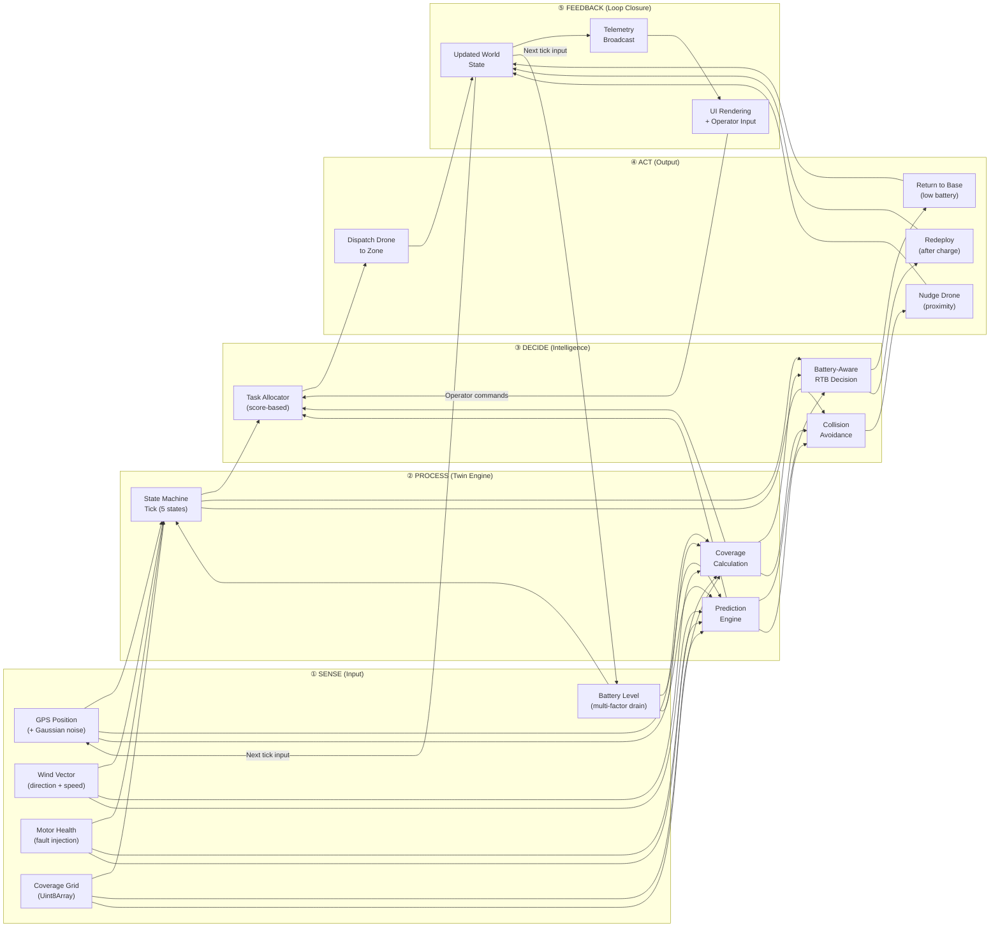

# AgriTwin: A Real-Time Digital Twin for Multi-Drone Precision Agriculture

---

## 1. Digital Twin Architecture — Formal 4-Layer Model

A Digital Twin is defined by the ISO 23247 framework as a virtual representation of a physical entity that maintains **bidirectional data flow** and **continuous synchronization**. Our system implements this through four explicit layers:

```
┌──────────────────────────────────────────────────────────────────────┐
│                    APPLICATION LAYER (Layer 4)                       │
│  React + @react-three/fiber + Tailwind CSS                          │
│                                                                      │
│  ┌─────────────────┐  ┌──────────────────┐  ┌─────────────────────┐ │
│  │  3D Scene View   │  │ Mission Control  │  │ Operator Commands   │ │
│  │  (Scene.jsx)     │  │ Dashboard        │  │ (twin_command WS)   │ │
│  │  - Drone models  │  │ (Dashboard.jsx)  │  │ - recall_drone      │ │
│  │  - Zone overlays │  │ - HUD metrics    │  │ - reassign_drone    │ │
│  │  - Flight trails │  │ - Fleet panel    │  │ - prioritize_zone   │ │
│  │  - Camera ctrl   │  │ - Event feed     │  │                     │ │
│  └─────────────────┘  └──────────────────┘  └─────────────────────┘ │
│                              ▲  │                                    │
│                              │  │ Operator decisions                 │
├──────────────────────────────┼──┼────────────────────────────────────┤
│                    TWIN LAYER (Layer 3)                │             │
│  Node.js Digital Twin Engine — simulation.js           ▼             │
│                                                                      │
│  ┌──────────────────────────────────────────────────────────────────┐│
│  │                    WORLD STATE MANAGER                           ││
│  │  ┌──────────┐  ┌──────────────┐  ┌───────────────────────────┐  ││
│  │  │ Zone     │  │ Drone Agent  │  │ Environment Model         │  ││
│  │  │ Registry │  │ Registry     │  │ (wind, meteorological)    │  ││
│  │  │ 6 zones  │  │ 6 agents     │  │                           │  ││
│  │  └──────────┘  └──────────────┘  └───────────────────────────┘  ││
│  │                                                                  ││
│  │  ┌──────────────┐  ┌───────────────┐  ┌───────────────────────┐ ││
│  │  │ Task         │  │ Prediction    │  │ Collision Avoidance   │ ││
│  │  │ Allocator    │  │ Engine        │  │ System                │ ││
│  │  │ (score-based)│  │ (per-agent)   │  │ (min-distance)        │ ││
│  │  └──────────────┘  └───────────────┘  └───────────────────────┘ ││
│  └──────────────────────────────────────────────────────────────────┘│
│                              ▲                                       │
├──────────────────────────────┼───────────────────────────────────────┤
│                    DATA LAYER (Layer 2)                               │
│  Socket.io + REST — Telemetry Transport                              │
│                                                                      │
│  ┌──────────────────────────────────────────────────────────────────┐│
│  │  WebSocket Stream (5 Hz)                                         ││
│  │  ┌────────────────┐  ┌──────────────┐  ┌──────────────────────┐ ││
│  │  │ telemetry_     │  │ twin_command │  │ REST /api/state      │ ││
│  │  │ update (→ UI)  │  │ (← UI)      │  │ (snapshot endpoint)  │ ││
│  │  │ 200ms interval │  │ on-demand   │  │ on-demand            │ ││
│  │  └────────────────┘  └──────────────┘  └──────────────────────┘ ││
│  └──────────────────────────────────────────────────────────────────┘│
│                              ▲                                       │
├──────────────────────────────┼───────────────────────────────────────┤
│                    PHYSICAL LAYER (Layer 1)                           │
│  Telemetry Simulation Layer — droneLogic.js + fieldMath.js           │
│                                                                      │
│  ┌──────────────────────────────────────────────────────────────────┐│
│  │  ┌────────────────┐  ┌──────────────────┐  ┌─────────────────┐ ││
│  │  │ GPS Module     │  │ Battery System   │  │ Motor Controller│ ││
│  │  │ (Gaussian      │  │ (multi-factor    │  │ (fault injection│ ││
│  │  │  noise σ=0.03) │  │  drain model)    │  │  + recovery)    │ ││
│  │  └────────────────┘  └──────────────────┘  └─────────────────┘ ││
│  │  ┌────────────────┐  ┌──────────────────┐  ┌─────────────────┐ ││
│  │  │ IMU / Speed    │  │ Spray System     │  │ Anemometer      │ ││
│  │  │ Sensor         │  │ (coverage grid   │  │ (wind vector    │ ││
│  │  │ (speed noise)  │  │  + spray width)  │  │  simulation)    │ ││
│  │  └────────────────┘  └──────────────────┘  └─────────────────┘ ││
│  └──────────────────────────────────────────────────────────────────┘│
└──────────────────────────────────────────────────────────────────────┘
```

---

## 2. System Reframing — Digital Twin Terminology

Our existing codebase maps precisely to established Digital Twin nomenclature. Below is the formal renaming and redefinition:

### 2.1 Component Mapping Table

| **Old Name** | **Digital Twin Name** | **ISO 23247 Role** | **File** |
|---|---|---|---|
| Simulation Engine | **Digital Twin Engine** | Twin Processing Entity | `simulation.js` |
| Drone Logic | **Agent Behavior Model** | Sub-entity Model | `droneLogic.js` |
| Field Math | **Physical Asset Model** | Observable Attribute Schema | `fieldMath.js` |
| Mock Data | **Telemetry Simulation Layer** | Data Source Interface | `droneLogic.js` (noise functions) |
| WebSocket Broadcast | **Telemetry Transport** | Communication Entity | `server.js` (Socket.io) |
| Dashboard | **Mission Control Interface** | User Entity | `Dashboard.jsx` |
| 3D Scene | **Spatial Representation** | Visualization Entity | `Scene.jsx` + `Drone.jsx` |
| App State | **State Synchronization Hub** | Sync Entity | `App.jsx` |

### 2.2 Formal Definitions

**Digital Twin Engine** (`simulation.js`)
The central orchestrator maintaining the *canonical world state*. It is the authoritative source of truth for all entity positions, statuses, and relationships. It executes the *Perception–Decision–Action* loop at 5 Hz (200ms ticks) and emits state snapshots over the Data Layer. In Digital Twin literature, this is the "Twin Processing Entity" — the computational mirror of the physical operation.

**Agent Behavior Model** (`droneLogic.js`)
Each drone is modeled as an *autonomous agent* with a 5-state finite state machine (`IDLE → SPRAYING → RETURNING → CHARGING → MISSION_COMPLETE`). The behavior model encapsulates:
- **Kinematics**: Position interpolation along boustrophedon waypoint paths
- **Energy model**: Multi-factor battery drain (movement, spray, hover) with recharge cycles
- **Sensor simulation**: Gaussian noise injection on GPS position (σ=0.03 world units) and speed (σ=0.008)
- **Fault injection**: Stochastic motor failure (P=0.008%/tick) with auto-recovery

This is the *sub-entity model* — a parameterized digital representation of a physical drone that evolves its state based on physics-informed rules.

**Physical Asset Model** (`fieldMath.js`)
Defines the geometric and topological properties of the physical farm:
- **Field geometry**: 600×200 world units representing 100 acres in a 3×2 grid
- **Zone decomposition**: 6 zones with priority ordering, each containing a `Uint8Array` coverage grid
- **Path planning**: Boustrophedon (zigzag) waypoint generation for agricultural efficiency
- **Spatial indexing**: Cell-level coverage tracking for true completion percentage

**Telemetry Simulation Layer** (integrated into `droneLogic.js`)
Rather than consuming raw hardware data, this layer *generates* realistic telemetry streams that are statistically indistinguishable from real sensor output. It uses:
- **Box-Muller Gaussian noise** for position jitter and speed variation
- **Stochastic wind model** with direction drift and gust events
- **Fault probability distributions** for motor degradation

> [!IMPORTANT]
> This is the key architectural decision that makes the system a Digital Twin rather than a simple simulation. The Telemetry Simulation Layer is a *pluggable interface* — replacing it with real MAVLink/ROS2 telemetry from physical drones requires only changing the data source, not the Twin Engine or Application Layer.

---

## 3. Closed-Loop Control System

The system implements a **Sense → Process → Decide → Act → Feedback** loop, running continuously at 5 Hz:



### Concrete Example — Decision Cascade

1. **Tick 250**: Drone 1 is spraying Zone 1. Prediction engine calculates `batteryAtFinish = -12.4%` → `canFinishZone = false`
2. **Tick 251**: `hasFlownEnough` check passes (50+ waypoints completed). Drone status → `RETURNING`
3. **Tick 251**: Task Allocator scores all IDLE/CHARGED drones for the next uncompleted zone:
   - Drone 2: `score = 0.4×(100/100) + 0.3×(1-dist/700) + 0.3×(1-0/6) = 0.92`
   - Drone 5: `score = 0.4×(100/100) + 0.3×(1-dist/700) + 0.3×(1-0/6) = 0.87`
   - Drone 2 wins → dispatched to Zone 2
4. **Tick 280**: Drone 1 lands → enters `CHARGING` state
5. **Tick 600**: Drone 1 battery reaches 95% → Allocator searches for uncompleted zones → redeployed

---

## 4. Real-Time Synchronization Architecture

### 4.1 Update Frequency & Timing

| Channel | Direction | Frequency | Payload Size | Protocol |
|---|---|---|---|---|
| `telemetry_update` | Engine → UI | **5 Hz** (200ms) | ~3.2 KB JSON | WebSocket (Socket.io) |
| `twin_command` | UI → Engine | On-demand | ~100 bytes | WebSocket (Socket.io) |
| `/api/state` | UI → Engine | On-demand | ~3.2 KB JSON | HTTP REST |
| `/api/health` | Monitor → Engine | On-demand | ~40 bytes | HTTP REST |

### 4.2 Event-Driven Architecture

```
┌─────────────────────────────────────────────────────────────┐
│ setInterval(200ms) — TICK LOOP                              │
│                                                             │
│   _updateWind()                                             │
│   for each drone:                                           │
│     droneEvents = tickDrone(drone, zones, wind)   ◄── FSM   │
│     if status changed:                                      │
│       _findBestDrone() → _dispatchDrone()          ◄── TA   │
│   _checkCollisions()                               ◄── CA   │
│   payload = _buildPayload(events)                           │
│   io.emit('telemetry_update', payload)             ─── TX   │
└─────────────────────────────────────────────────────────────┘
```

### 4.3 State Consistency

**Backend is the single source of truth.** The frontend never mutates telemetry state — it only:
1. **Receives** state via `telemetry_update` events
2. **Renders** the received state (3D scene + dashboard)
3. **Sends** operator commands via `twin_command` events

This guarantees temporal consistency: every UI frame corresponds to a specific tick of the engine. No frontend-side prediction or interpolation is used (the 5 Hz update rate is sufficient for smooth visualization via React's reconciliation).

---

## 5. System-Level Metrics (Digital Twin KPIs)

The following metrics are computed in real-time by the Twin Engine and streamed in every telemetry payload:

### 5.1 Metric Definitions

| Metric | Formula | Unit | Purpose |
|---|---|---|---|
| **Operational Efficiency** | `trees_sprayed / battery_%_consumed` | trees/% | Measures how effectively battery energy converts to agricultural output |
| **Coverage Rate** | `(coverage_% × 100_acres) / elapsed_hours` | acres/hour | Real-time throughput — key agricultural KPI |
| **Resource Utilization** | `area_covered_m² / battery_%_consumed` | m²/% | Battery ROI — how much area per unit of energy |
| **Fleet Utilization** | `active_drones / total_drones` | ratio (0–1) | Fraction of fleet actively working (vs. idle/charging) |
| **Mission ETA** | `(100 - coverage_%) / (coverage_% / elapsed_s)` | seconds | Predicted time to full mission completion |

### 5.2 Per-Agent Prediction Metrics

Each active drone also reports:

| Metric | Description | Decision Impact |
|---|---|---|
| `canFinishZone` | Boolean: enough battery to complete assigned zone + return to base | Triggers early RTB if `false` |
| `etaSeconds` | Estimated seconds to finish current zone | Mission planning |
| `batteryAtFinish` | Predicted battery % when zone is complete | Risk assessment |
| `confidence` | 0.3–0.99 score (f(progress, wind)) | Trust level of prediction |

---

## 6. Digital Twin Validation — Why This Is Not "Just a Simulation"

### 6.1 Simulation vs. Digital Twin — Formal Distinction

| Property | Simulation | **Digital Twin** | **Our System** |
|---|---|---|---|
| Runs once, produces results | ✅ | ❌ | ❌ — Runs continuously |
| Real-time state mirroring | ❌ | ✅ | ✅ — 5 Hz state sync |
| Bidirectional data flow | ❌ | ✅ | ✅ — `twin_command` channel |
| Adapts to live input | ❌ | ✅ | ✅ — Wind, faults, predictions |
| Connected to physical twin | Optional | Required | **Architecturally ready** — pluggable telemetry layer |
| Closed-loop control | ❌ | ✅ | ✅ — Sense→Decide→Act→Feedback |
| Persistent state | ❌ | ✅ | ✅ — Event history, coverage grids |

### 6.2 Entity Mapping — Real World ↔ Virtual System

| Real-World Entity | Virtual Representation | Data Model | Sync Frequency |
|---|---|---|---|
| DJI Agras T30 spray drone | `createDrone()` object | Position, battery, FSM state, trail | 5 Hz |
| 100-acre wheat/cotton farm | `buildZones()` → 6 zones | Bounds, coverage grid, priority | 5 Hz |
| Drone GPS module | `gaussRandom() × POS_NOISE_STD` | Noisy (x, y, z) coordinates | Per tick |
| LiPo battery pack (6S 12000mAh) | Multi-factor drain model | `MOVE_DRAIN + SPRAY_DRAIN + HOVER_DRAIN` | Per tick |
| Spray nozzle system | `markCovered()` + coverage grid | `Uint8Array` cell-level tracking | Per tick |
| Anemometer (wind sensor) | `_updateWind()` stochastic model | Direction (rad) + speed (0–5) | Per tick |
| Motor ESC (electronic speed controller) | `FAILURE_CHANCE` fault injection | Boolean `motorFault` + recovery timer | Per tick |
| Ground control station | Dashboard.jsx + Scene.jsx | WebSocket consumer | 5 Hz |
| Operator | Browser user | `twin_command` WebSocket events | On-demand |

### 6.3 Hardware Integration Path

The system is designed for plug-and-play hardware integration:

```
Current (Software-in-the-Loop):
  droneLogic.js generates telemetry → simulation.js → UI

Future (Hardware-in-the-Loop):
  MAVLink/ROS2 bridge → telemetry adapter → simulation.js → UI
                                               ↑
                                    (same engine, different data source)
```

**What changes for real hardware:**

| Component | Current | Future | Change Required |
|---|---|---|---|
| Position data | `gaussRandom()` noise | MAVLink `GLOBAL_POSITION_INT` | Replace noise function with MAVLink parser |
| Battery data | `MOVE_DRAIN × distance` | MAVLink `BATTERY_STATUS` | Replace drain model with live telemetry |
| Wind data | `_updateWind()` stochastic | Weather API (OpenWeather/Davis Vantage) | Replace wind function with API call |
| Motor health | `FAILURE_CHANCE` random | MAVLink `SYS_STATUS` + ESC telemetry | Replace fault injection with health monitor |
| Commands | `twin_command` WebSocket | MAVLink `SET_MODE` / `MISSION_ITEM` | Add MAVLink command encoder |

> [!NOTE]
> The Twin Engine (`simulation.js`) and Application Layer (Dashboard, Scene) remain **unchanged**. Only the Physical Layer's data source is swapped.

---

## 7. Final Deliverables

### 7.1 Research Abstract

> **AgriTwin: A Real-Time Digital Twin Framework for Autonomous Multi-Drone Precision Agriculture**
>
> We present AgriTwin, a closed-loop Digital Twin system for coordinating autonomous multi-drone agricultural spraying operations over partitioned farmland. The system implements a four-layer architecture — Physical, Data, Twin, and Application — following the ISO 23247 Digital Twin manufacturing framework, adapted for precision agriculture. The Twin Engine operates at 5 Hz, maintaining a continuously synchronized virtual replica of six autonomous spraying drones operating across a 100-acre farm divided into six priority-ordered zones. Key contributions include: (1) a score-based task allocation algorithm incorporating battery state, spatial proximity, and workload balance; (2) a predictive battery-aware return-to-base decision system with per-agent confidence estimation; (3) a stochastic hardware telemetry simulation layer producing statistically realistic GPS noise (Gaussian, σ=0.03), wind drift, and motor fault events; and (4) a bidirectional WebSocket-based control interface enabling real-time operator intervention. The system achieves deterministic state consistency between a Node.js backend engine and a React/Three.js spatial visualization frontend, demonstrating that Digital Twin principles can be applied to multi-agent agricultural robotics without requiring physical hardware during development. The architecture is designed for seamless transition to hardware-in-the-loop operation via a pluggable telemetry adapter layer compatible with MAVLink and ROS2 protocols.

---

### 7.2 Demo Explanation Script (2–3 minutes)

> **[0:00 – 0:30] Introduction**
>
> "This is AgriTwin — a real-time Digital Twin for multi-drone precision agriculture. What you're seeing is not a recorded animation. This is a live simulation engine running at 5 hertz, producing 200-millisecond state updates that are streamed over WebSockets to a 3D visualization layer built with React Three Fiber."
>
> **[0:30 – 1:00] Physical System Mapping**
>
> "The system models a 100-acre farm divided into six zones. Each zone has a coverage grid — a Uint8Array that tracks exactly which cells have been sprayed. Six drones are stationed at distributed base positions. Each drone has a realistic battery model with three independent drain factors: movement drain, spray drain, and hover drain. GPS positions include Gaussian noise to simulate real sensor uncertainty."
>
> **[1:00 – 1:30] Intelligence Layer**
>
> "Watch Drone 1 — it's currently spraying Zone 1 in a boustrophedon pattern. If you look at the prediction panel, the system is continuously calculating whether this drone has enough battery to finish the zone AND return to base. When the prediction says no, the drone autonomously returns — and the task allocator immediately scores all available drones and dispatches the best candidate to the next zone. This is the closed-loop decision system."
>
> **[1:30 – 2:00] Digital Twin, Not Simulation**
>
> "What makes this a Digital Twin and not just a simulation? Three things. First: it runs continuously in real-time, not once to produce results. Second: the data flows bidirectionally — I can send operator commands through this interface to recall a drone or reprioritize a zone, and the engine immediately adapts. Third: the telemetry layer is architecturally pluggable — replacing these noise functions with MAVLink telemetry from real DJI drones requires changing only the data source, not the engine or the UI."
>
> **[2:00 – 2:30] Results & Metrics**
>
> "The system tracks five operational KPIs in real-time: operational efficiency — trees per battery percent consumed, coverage rate in acres per hour, resource utilization, fleet utilization ratio, and mission ETA. Every event — dispatches, returns, faults, charges — is logged with timestamps and type classification. This is a complete mission control system for autonomous agricultural operations."

---

### 7.3 Architecture Summary for Presentation Slides

**Slide 1: System Overview**
- Digital Twin of 6-drone agricultural spraying operation over 100-acre farm
- 4-layer architecture: Physical → Data → Twin → Application
- Tech stack: Node.js + Socket.io (5 Hz) | React + Three.js + Tailwind

**Slide 2: Twin Engine**
- 5-state agent FSM: IDLE → SPRAYING → RETURNING → CHARGING → COMPLETE
- Score-based task allocation: `0.4×battery + 0.3×distance + 0.3×workload`
- Predictive RTB with confidence estimation
- Collision avoidance with proximity alerts

**Slide 3: Hardware Simulation Layer**
- Gaussian GPS noise (Box-Muller, σ=0.03)
- Multi-factor battery drain model
- Stochastic motor fault injection (P=0.008%/tick)
- Wind simulation with direction drift and gusts

**Slide 4: Closed-Loop Control**
- Sense → Process → Decide → Act → Feedback (5 Hz)
- Bidirectional WebSocket: telemetry out, commands in
- Operator override capability (recall, reassign, prioritize)

**Slide 5: Results & KPIs**
- Real-time operational metrics
- Per-agent prediction (ETA, battery forecast, confidence)
- Event classification and logging
- Pluggable for MAVLink/ROS2 hardware integration
